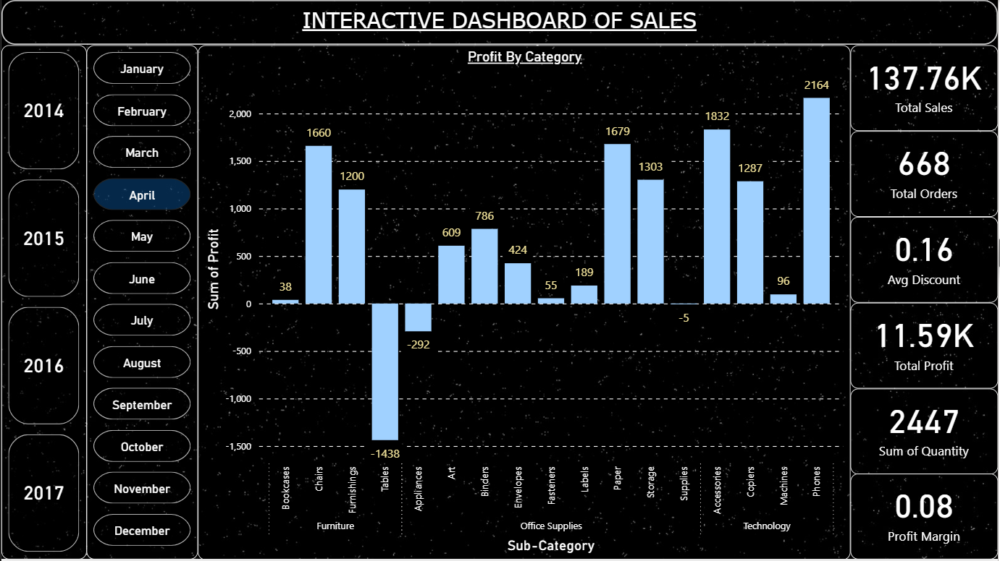
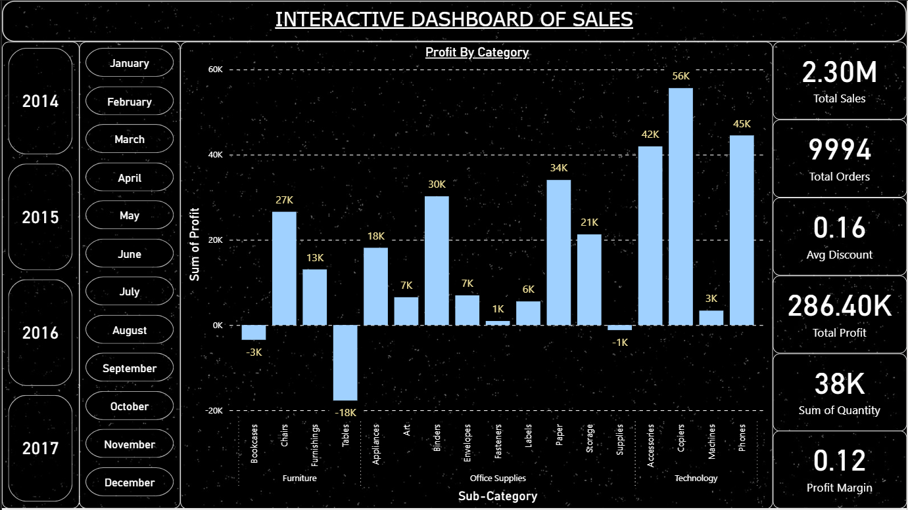
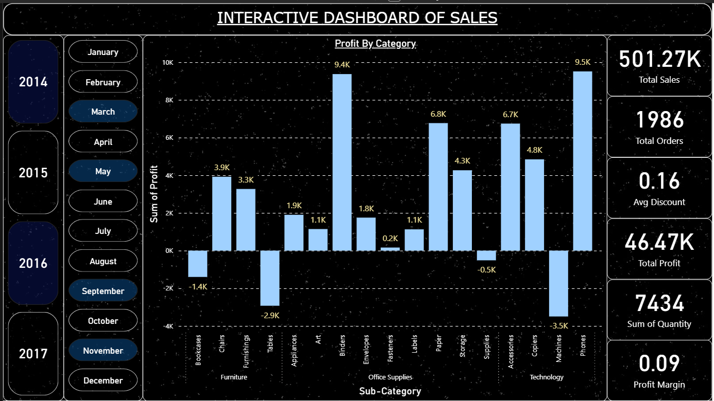

# 📊 Sales Performance Analysis — Superstore Dataset

This project presents a comprehensive analysis of sales performance using the **Superstore dataset**, aimed at uncovering actionable business insights. The analysis is performed using **Excel**, **Python (Pandas & Matplotlib)**, and **Power BI** to build both static and interactive dashboards.

---

## 🧠 Objective

To identify trends, customer behavior patterns, high- and low-performing products, discount impacts, and regional profitability — while developing end-to-end analytics skills with real-world tools.

---

## 🛠️ Tools & Technologies Used

- **Excel** – Data cleaning, PivotTables, and chart visualizations  
- **Python** – Pandas, Matplotlib for data manipulation and EDA  
- **Power BI** – Interactive dashboard creation for deeper insights  
- **Jupyter Notebook** – Python scripting and documentation  

---

## ⚙️ Project Workflow

### 1. 🔍 Data Cleaning (Excel + Python)
- Removed irrelevant columns (e.g., `Row ID`)
- Converted `Order Date` and `Ship Date` into datetime format
- Created additional time columns: `Order Year`, `Order Month`
- Trimmed whitespace and fixed inconsistencies
- Checked for and confirmed absence of null values

> ✅ Cleaning done in both Excel and Python for comparative understanding of tool capabilities.

---

### 2. 📋 Dataset Structure

Key columns analyzed:
- **Sales, Quantity, Discount, Profit** – core financial metrics  
- **Category, Sub-Category, Product Name** – product performance analysis  
- **Region, State, City** – geographic performance insights  
- **Segment, Customer Name** – customer segmentation and loyalty  
- **Order/Ship Dates** – time series trends  

---

## 🎯 Analysis Goals

Guided by domain knowledge and exploratory instincts:
- Identify **top and bottom-performing product categories**
- Assess **sales and profit trends by region and segment**
- Understand **discount–profit correlation**
- Track **monthly and yearly revenue/profit trends**
- Highlight **loss-making states/customers**

---

## 📊 Visual Analysis in Excel

Used **PivotTables** and **Charts** to:
- Visualize **sales and profit by region**
- Compare **sub-category and category performance**
- Plot **discount vs profit correlations**
- Analyze **monthly revenue trends**
- Display **customer segments distribution**

---

## 📈 Interactive Dashboard in Power BI

A dynamic dashboard was built using **Power BI** to allow deep filtering, interactivity, and real-time updates. Key features:
- Drilldowns by **region, state, category, sub-category**
- Interactive filtering on **segments and discounts**
- Line charts for **time-series profit/sales trends**
- Bar and map visuals for **regional performance**

> 🚀 Power BI enhances stakeholder presentation with interactive and real-time dashboard capabilities.

### 🖼️ Power BI Dashboard Previews

  
  
  

---

## 👨‍💻 Author

**Yashdeep Saxena**  
Aspiring Data Analyst | B.Tech Final Year  
[GitHub](https://github.com/Yashu278) | [LinkedIn](https://www.linkedin.com/in/yashdeep-saxena-3a6914295)

---
